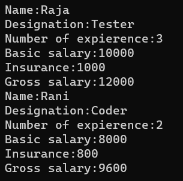

# Exp03-Constructor
## Aim: 
To write a C# program to calculate the salary of an employee by passing the name, designation, noofexperience, basic salary and insurance amount through constructor.

## Algorithm:
### Step1:
Create a class Program
### Step2:
Create the constuctor for the Class program
### Step3
Calculate the hra,ta,gross salary using the basic salary using the function salary(). 
### Step4:
Display the details using function display().
### Step5:
Create objects for the class.
### Step6:
Invoke the class members using objects.
## Program:
```
using System;
namespace Constructor1
{
   public class Program
   {
    int exp,bs,insurance;
    string name,designation;
    float hra,ta,gs;
    public Program(string name,string designation,int exp,int bs,int insurance)
    {
        this.name=name;
        this.designation=designation;
        this.exp=exp;
        this.bs=bs;
        this.insurance=insurance;
    }
    public void salary()
    {
        hra=(float)0.2*bs;
        ta=(float)0.1*bs;
        gs=bs+hra+ta-insurance;
    }
    public void display()
    {
        Console.WriteLine("Name:"+name);
        Console.WriteLine("Designation:"+designation);
        Console.WriteLine("Number of expierence:"+exp);
        Console.WriteLine("Basic salary:"+bs);
        Console.WriteLine("Insurance:"+insurance);
        Console.WriteLine("Gross salary:"+gs);
    }
   }
   public class Exp3
   {
       static void Main(String[] args)
       {
        Program obj1=new Program("Raja","Tester",3,10000,1000);
        obj1.salary();
        obj1.display();
        Program obj2=new Program("Rani","Coder",2,8000,800);
        obj2.salary();
        obj2.display();
       }
   }
}
```

## Output:

## Result:
Thus,the C# program to calculate the salary of an employee by passing the name, designation, noofexperience, basic salary and insurance amount through constructor is successfully executed.